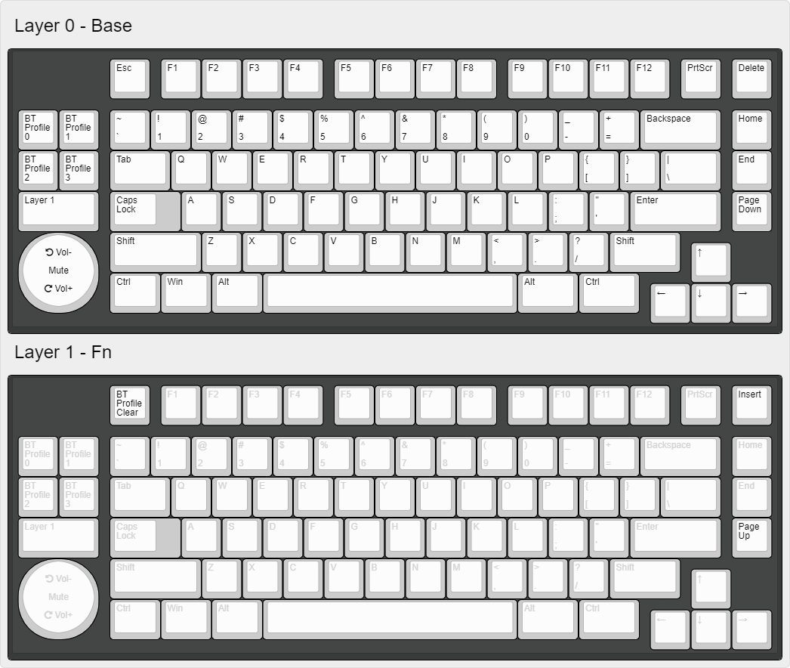

# RDG75XT ZMK Configuration

## 6.25u with Encoder + Macro

## Remapping

Use the [ZMK Keymap Editor](https://nickcoutsos.github.io/keymap-editor/).

More info about the various keycodes can be found in the ZMK docs:

- https://zmk.dev/docs/behaviors/key-press
- https://zmk.dev/docs/behaviors/layers
- https://zmk.dev/docs/behaviors/bluetooth
- https://zmk.dev/docs/behaviors/outputs
- https://zmk.dev/docs/codes
